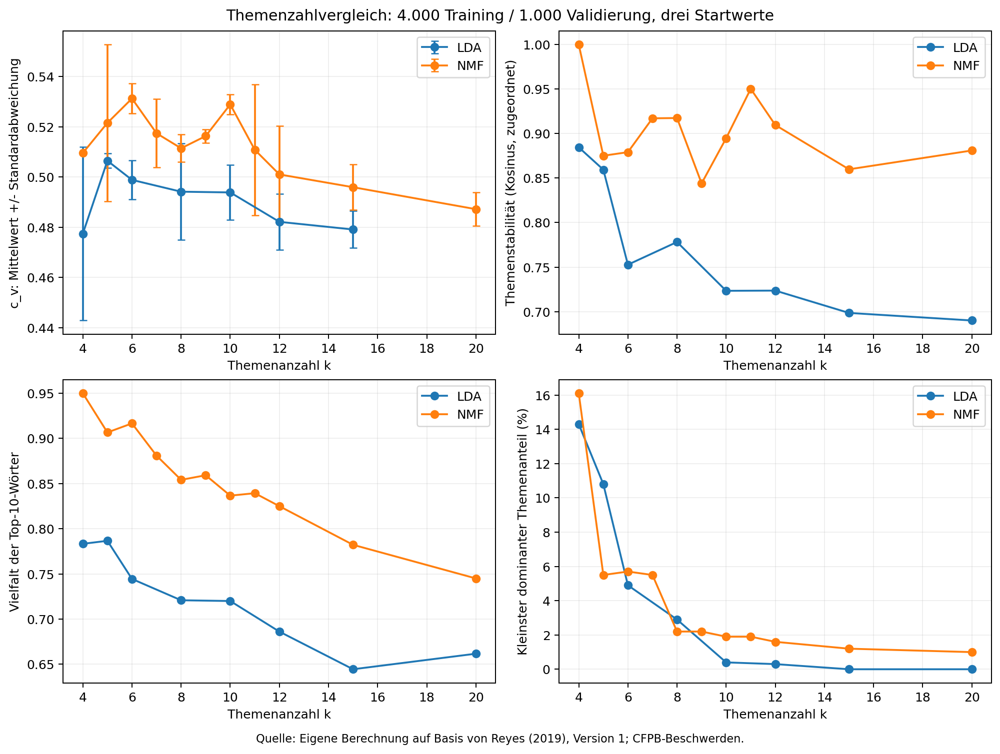

# Themenanalyse historischer Verbraucherbeschwerden

Reproduzierbarer Vergleich von **LDA mit Wortzählungen** und **NMF mit TF-IDF**
auf 5.000 englischsprachigen Beschwerden. Im Mittelpunkt steht die begründete
Auswahl der Themenanzahl anhand von Kohärenz, Stabilität und inhaltlicher Prüfung.

## Ergebnisse lesen

- [Ergebnisse, Themenanteile und begründete Auswahl](docs/ergebnisse.md)
- [Methoden und Einschränkungen](docs/methodik.md)
- [Vor dem Training festgelegter Versuchsplan](docs/versuchsplan.md)
- [Alle Modellvergleiche als CSV](results/model_selection.csv)
- [Datenqualität](results/data_audit.json) und [Vektorisierungsvergleich](results/vectorization.json)
- [Prüfbericht](results/validation.json)



## Installation

Getestete Umgebung: **Python 3.12 auf Windows**, ohne GPU.
Die Modellierung erfolgt lokal; ein Sprachmodellserver ist nicht erforderlich.

```powershell
git clone https://github.com/siggismalz/iu-data-analysis-nlp.git
cd iu-data-analysis-nlp
py -3.12 -m venv .venv
.\.venv\Scripts\python.exe -m pip install -r requirements-lock.txt
.\.venv\Scripts\python.exe -m pip check
```

`requirements.txt` enthält die direkt verwendeten Pakete einschließlich
spaCy-Sprachmodell; `requirements-lock.txt` den vollständigen Export der
ausgeführten Umgebung. Für andere Betriebssysteme: `python3.12 -m venv .venv`
und anschließend `.venv/bin/python` statt des Windows-Pfads verwenden.
Plattformübergreifend sind kleine numerische Abweichungen möglich.

## Vollständige Ausführung

```powershell
.\.venv\Scripts\python.exe run_all.py
```

Das Skript lädt die exakt bezeichnete historische Kaggle-Version herunter,
prüft die SHA256, bereitet die Stichprobe vor, schätzt alle Kandidaten,
verfeinert die Themenzahlsuche und erstellt Diagramme, Ergebnistabellen und
Prüfbericht. Der Download umfasst etwa 184 MB; das ZIP enthält eine etwa
737 MB große CSV. Zusätzlicher Platz wird für Umgebung und lokale Modelle benötigt.
Je nach Rechner kann der Lauf mehrere Minuten oder länger dauern.

Ist das Original-ZIP bereits vorhanden oder der automatische Download nicht
erreichbar, die [Kaggle-Version 1](https://www.kaggle.com/datasets/selener/consumer-complaint-database/versions/1)
manuell herunterladen und ihren Pfad übergeben:

```powershell
.\.venv\Scripts\python.exe run_all.py --archive "C:\Daten\consumer-complaint-database-v1.zip"
```

Erwartete ZIP-SHA256:
`a2ee5d14aae1dba483e70ae94a96af7f401a09fb1011028f44bc59a32138f453`.
Andere Datenversionen werden absichtlich abgewiesen. Die Ergebnisse dieses
Repositories beziehen sich ausschließlich auf diese Datei.

## Einzelne Schritte

```powershell
.\.venv\Scripts\python.exe analyse.py prepare --archive "C:\Daten\consumer-complaint-database-v1.zip"
.\.venv\Scripts\python.exe analyse.py sweep
.\.venv\Scripts\python.exe analyse.py refine
.\.venv\Scripts\python.exe report.py
.\.venv\Scripts\python.exe validate.py
```

Modellartefakte mit passender Eingabesignatur werden wiederverwendet.
`config.json` enthält Stichprobengröße, Seeds, Filter und Modellsuchraum.
`interpretation.json` hält die begründete Entscheidung und Themenlabels fest.
Eine andere Stichprobe oder andere Themenwortlisten erfordern eine erneute
inhaltliche Prüfung; `report.py` verhindert die ungeprüfte Übernahme alter Labels.
Nach Änderungen der Konfiguration sollte ein neuer Arbeitsordner verwendet
werden, damit die im Repository berichtete Auswertung erhalten bleibt.

## Struktur

| Datei/Ordner | Inhalt |
|---|---|
| `analyse.py` | Download, Bereinigung, Vektorisierung, Modelle, c_v und Stabilität |
| `report.py` | Skalierte Themenanteile, Diagramme und Ergebnisdokumentation |
| `run_all.py` | Vollständiger Ablauf |
| `validate.py`, `tests/` | Daten-, Rechen- und Methodenkontrollen |
| `docs/` | Versuch, Methode und Diskussion |
| `results/` | Aggregierte Tabellen, Diagramme und Prüfberichte |
| `data/` | Nur lokal: Datenarchiv, von Git ausgeschlossen |
| `private/` | Nur lokal: Textstichprobe, Textbeispiele und Modelle, von Git ausgeschlossen |

## Datennutzung und Aussagegrenzen

Quelle: Selene Reyes, *Consumer Complaint Database*, Version 1 vom 13.05.2019;
Originaldaten des Consumer Financial Protection Bureau. Kaggle bezeichnet die
Lizenz als **U.S. Government Works**. Dieses Repository veröffentlicht keine
Beschwerderohtexte. Daten, gespeicherte Dokumentzuordnungen und Beispiele werden
erst lokal erzeugt. Die Quelldaten wurden teilweise maskiert; zusätzliche
automatische Bereinigung bietet keine Garantie vollständiger Anonymität.

Die Untersuchung demonstriert einen Analyseablauf. Beschwerdeanteile sind keine
Bevölkerungsanteile, keine Dringlichkeitsmessung und kein Nachweis des Wahrheitsgehalts
der Beschwerden. Die gewählte Themenzahl hängt von Daten, Vorverarbeitung,
Modell und Auswahlkriterien ab. Die Validierung dient der Modellauswahl und
ersetzt keinen unabhängigen Test oder eine Bewertung durch mehrere Personen.

## Nachvollziehbarkeit

Alle numerischen Ergebnisse wurden mit dem enthaltenen Code berechnet.
Die Themenlabels und ihre Begründungen sind in `interpretation.json` dokumentiert.
Fachliche Quellen sind in [methodik.md](docs/methodik.md) angegeben.
