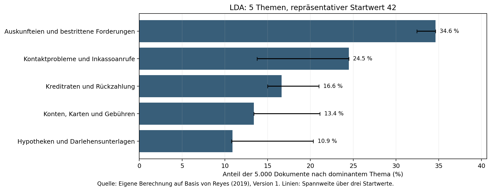
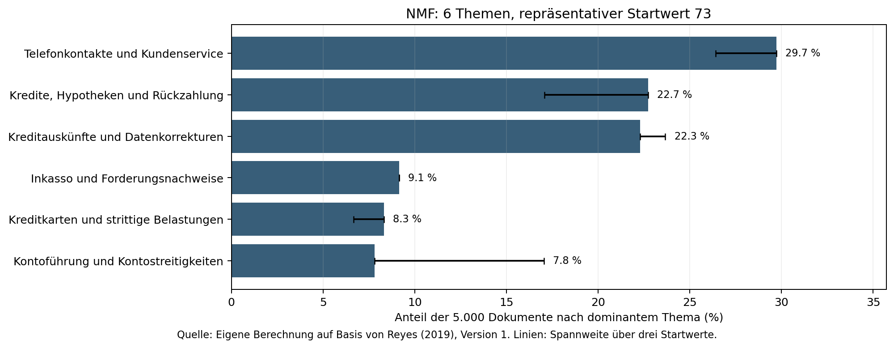
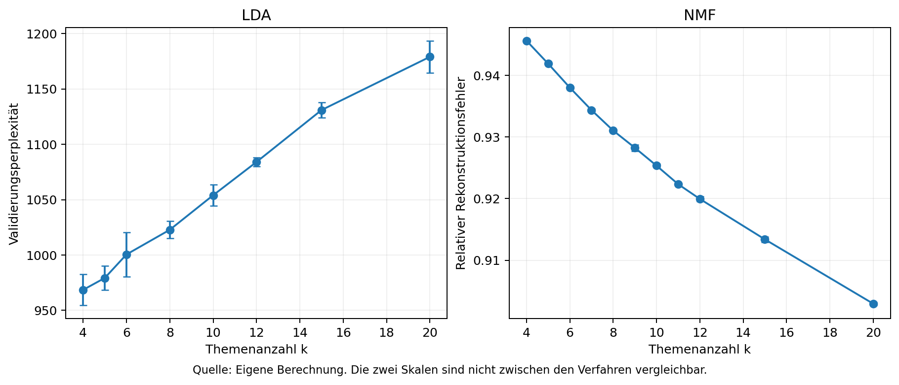

# Ergebnisse der Themenanalyse

Die Kennzahlen wurden lokal berechnet. Die Themenbezeichnungen und Inhaltsnotizen beruhen auf der Sichtung ausgewählter Textausschnitte.

Aus 1,282,355 Datensätzen enthalten 383,564 einen Beschwerdetext. Nach Grundbereinigung und Dublettenentfernung verbleiben 362,347 Kandidaten. Für die Auswahl von 5.000 geeigneten Texten wurden 5,459 zufällig geordnete Kandidaten geprüft. Die ausgewählten Beschwerden reichen vom 2015-03-19 bis 2019-03-14.

## Vergleich der Vektorisierungen

Count und TF-IDF verwenden dieselben 3,071 Merkmale und besitzen eine Besetzungsdichte von 1.624 %. Beide dünnbesetzten Matrizen benötigen jeweils 3,013,056 Bytes für Werte und Indexarrays. Die Gewichtung ändert also die Geometrie, nicht die Zahl der belegten Einträge.

| Diagnose im gemeinsamen Pool von 300 Trainingsdokumenten | Count | TF-IDF |
|---|---:|---:|
| Mittlere Kosinusähnlichkeit über 44,850 Paare | 0.1222 | 0.0584 |

Der nächste Nachbar stimmt nur für 42.33 % der Dokumente überein. TF-IDF schwächt verbreitete Begriffe relativ ab und verändert dadurch die Nachbarschaften. Die geringere mittlere Ähnlichkeit ist für sich genommen kein Qualitätsnachweis. Count liefert diskrete Häufigkeiten für LDA; TF-IDF wird für NMF verwendet. Damit vergleicht die Untersuchung zwei komplette Kombinationen aus Darstellung und Modell. Ein Unterschied lässt sich nicht allein auf das Modellverfahren zurückführen.

Die zusätzliche Diagnose im gesamten Korpus findet 14 Textpaare mit TF-IDF-Kosinusähnlichkeit ab 0,95; davon liegt 1 Paar über der Trainings-/Validierungsgrenze. Solche ähnlichen Texte können die Bewertung begünstigen; die exakte Dublettenbereinigung entfernt nicht jede sinngleiche Beschwerde.

## Wahl der Themenanzahl

| Verfahren | k | c_v, Mittelwert ± SD | Stabilität | Startwert |
|---|---:|---:|---:|---:|
| LDA | 5 | 0.506 ± 0.003 | 0.859 | 42 |
| NMF | 6 | 0.531 ± 0.006 | 0.879 | 73 |

**LDA:** Fünf Themen erreichen den höchsten berechenbaren mittleren c_v-Wert (0,506) bei geringer Streuung (0,003) und Stabilität 0,859. Vier Themen sind stabiler (0,885), verlieren aber Kohärenz (0,477); sechs Themen sind weniger stabil (0,753). Die Sichtung zeigt fünf benennbare, teilweise überlappende Bereiche. LDA k=20 bleibt wegen eines in der Validierung fehlenden Topworts bei einem Startwert ohne Kohärenzmittelwert; zusätzlich entstehen dort kaum besetzte Themen.

**NMF:** Die automatische Sparsamkeitsregel schlägt fünf Themen vor, weil deren Kohärenz höchstens 0,02 unter dem Maximum liegt. Nach inhaltlicher Sichtung werden sechs Themen gewählt: Sie erreichen das höchste mittlere c_v (0,531 ± 0,006), gegenüber 0,522 ± 0,031 bei fünf, und trennen Bankkonten von Kreditkarten. Stabilität 0,879 und mindestens 5,7 % dominante Validierungsdokumente je Thema über alle drei Seeds sind ausreichend nach dem Vorabplan. Sieben Themen (c_v=0,517) trennen Rückzahlungsprozesse zusätzlich, zehn (0,529) liefern eine ähnliche Kohärenz bei höherer Komplexität. Die Wahl sechs ist eine dokumentierte Abwägung und kein mathematischer Nachweis eines globalen Optimums.

Der vollständige Vergleich steht in [model_selection.csv](../results/model_selection.csv). Die Validierung wurde für die Auswahl genutzt und ist kein unabhängiger Test. Fehlerbalken beschreiben drei Initialisierungen, keine Unsicherheit über die Bevölkerung.

## Häufigste Themen

### LDA

| Thema | Dokumente | Anteil | Topwörter |
|---|---:|---:|---|
| Auskunfteien und bestrittene Forderungen | 1731 | 34.62 % | credit, report, account, debt, information, dispute, request, collection, remove, letter |
| Kontaktprobleme und Inkassoanrufe | 1224 | 24.48 % | call, tell, say, receive, phone, send, time, number, ask, no |
| Kreditraten und Rückzahlung | 831 | 16.62 % | payment, loan, pay, month, time, year, late, interest, tell, credit |
| Konten, Karten und Gebühren | 670 | 13.40 % | account, card, bank, charge, credit, fee, check, balance, customer, pay |
| Hypotheken und Darlehensunterlagen | 544 | 10.88 % | mortgage, loan, home, request, modification, document, state, property, insurance, letter |

### NMF

| Thema | Dokumente | Anteil | Topwörter |
|---|---:|---:|---|
| Telefonkontakte und Kundenservice | 1486 | 29.72 % | call, tell, phone, number, say, ask, receive, time, send, contact |
| Kredite, Hypotheken und Rückzahlung | 1136 | 22.72 % | payment, loan, pay, mortgage, month, interest, late, year, modification, rate |
| Kreditauskünfte und Datenkorrekturen | 1114 | 22.28 % | report, credit, information, dispute, remove, account, inquiry, equifax, file, experian |
| Inkasso und Forderungsnachweise | 457 | 9.14 % | debt, collection, owe, letter, validation, collect, company, agency, original, collector |
| Kreditkarten und strittige Belastungen | 416 | 8.32 % | card, credit, charge, chase, fee, balance, pay, purchase, late, statement |
| Kontoführung und Kontostreitigkeiten | 391 | 7.82 % | account, bank, check, open, close, deposit, fee, money, fund, america |

## Inhaltliche Einordnung

- **LDA 1 - Auskunfteien und bestrittene Forderungen:** Die Beispiele betreffen bestrittene Schulden, fehlerhafte Auskunfteieinträge und Nachweise. Der Bereich verbindet Auskunft und Inkasso; er trennt diese Anliegen nicht zuverlässig.
- **LDA 2 - Konten, Karten und Gebühren:** Starke Beispiele betreffen Überziehungsgebühren; zufällige Beispiele verlorene Karten und strittige Kontobelastungen. Das Thema bleibt ein breiter Bereich des Zahlungsverkehrs.
- **LDA 3 - Kontaktprobleme und Inkassoanrufe:** Die Ausschnitte zeigen wiederholte Inkassoanrufe, ausbleibende Rückrufe und erfolglose Kontaktversuche. Das Thema beschreibt häufig einen Beschwerdeprozess statt eines bestimmten Finanzprodukts.
- **LDA 4 - Hypotheken und Darlehensunterlagen:** Hypothekenänderungen und fehlende Darlehensunterlagen prägen die Beispiele. Ein zufälliger Text betrifft ein anderes Darlehen; daher ist eine ausschließlich auf Hypotheken begrenzte Bezeichnung zu eng.
- **LDA 5 - Kreditraten und Rückzahlung:** Die Beispiele behandeln Rückzahlungspläne, Zinsen, Zahlungsbuchungen und Studienkredite. Die dominante Zuordnung vereinfacht Beschwerden, die zugleich Serviceprobleme enthalten.
- **NMF 1 - Telefonkontakte und Kundenservice:** Starke Beispiele schildern unerwünschte Anrufe; ein zufälliger Ausschnitt betrifft widersprüchliche Auskünfte zur Kreditablösung. Deshalb umfasst das Label auch Kundenservice und nicht nur Telefonbelästigung.
- **NMF 2 - Inkasso und Forderungsnachweise:** Bestrittene oder nicht belegte Forderungen stehen im Vordergrund. Die Texte sind Behauptungen der Beschwerdeführenden; ein Rechtsverstoß wird daraus nicht abgeleitet.
- **NMF 3 - Kredite, Hypotheken und Rückzahlung:** Studienkredite, Hypotheken und Probleme bei Rückzahlungsplänen oder Zahlungsbuchungen werden zusammengefasst. Diese verbleibende Breite ist der Preis der übersichtlichen Auflösung mit sechs Themen.
- **NMF 4 - Kontoführung und Kontostreitigkeiten:** Starke Beispiele betreffen Kontoeröffnung, Kontoschließung und Gebühren. Die zwei zufälligen Beispiele handeln dagegen vor allem von Auskunfteien beziehungsweise Inkasso. Häufige Wörter wie account können Fehlzuordnungen verursachen; das Label ist deshalb keine zuverlässige Einzelfallklassifikation.
- **NMF 5 - Kreditkarten und strittige Belastungen:** Kreditkartenlimits, bestrittene Belastungen und Zinsabrechnungen bilden einen vom Bankkonto besser unterscheidbaren Bereich. Einzelne Beispiele verbinden diesen mit Identitätsmissbrauch oder Servicethemen.
- **NMF 6 - Kreditauskünfte und Datenkorrekturen:** Beanstandete Kreditanfragen, fehlerhafte Einträge und erfolglose Korrekturanträge stehen im Vordergrund. Dieses Thema überschneidet sich sachlich mit bestrittenen Forderungen.

## Vergleich und Grenzen

NMF mit sechs Themen wird für die übersichtliche Ergebnisdarstellung bevorzugt. Seine Kohärenz und Themenstabilität liegen im gewählten Vergleich über LDA mit fünf Themen; zugleich werden Bankkonten und Kreditkarten getrennt. Das bedeutet keine generell höhere Genauigkeit. Der Vergleich betrifft zwei vollständige Pipelines (Count/LDA und TF-IDF/NMF), sodass Unterschiede nicht allein einer Modellfamilie zugeschrieben werden können. Die Stichprobe enthält 14 sehr ähnliche Dokumentpaare (TF-IDF-Kosinus mindestens 0,95); eines verbindet Training und Validierung. Vorlagentexte und diese Überschneidung können Qualitätsmaße günstig beeinflussen. Weitere Grenzen sind die heuristische Sprach- und Entitätserkennung, entfernte Zahlen, Markenwörter, Bag-of-Words ohne Satzkontext und die dominante Zuordnung von Mehrthemenbeschwerden. Bei der Sichtung traten insbesondere im NMF-Kontothema unpassende Einzelfälle auf. Die Standardabweichungen und Anteilsspannen erfassen ausschließlich drei Startwerte, keine Stichprobenunsicherheit. Die Auswahl wurde im untersuchten Bereich k=4 bis 20 getroffen; nicht jede ganze Zahl dieses Bereichs wurde geprüft. Eine andere Vorverarbeitung, neue Stichprobe oder andere inhaltliche Granularität kann zu einer anderen Themenzahl führen.

Die Übereinstimmung der dominanten Zuordnungen zwischen beiden Verfahren beträgt ARI = 0.372. Dies beschreibt die Übereinstimmung zweier Modelle und ist kein Genauigkeitsnachweis.

Alle Dokumentanteile beziehen sich auf genau 5.000 eindeutige ausgewählte Texte. Historische Finanzbeschwerden sind keine repräsentative Stichprobe kommunaler Anliegen. Häufigkeit misst weder Dringlichkeit noch den Wahrheitsgehalt einzelner Beschwerden.

Datenquelle: Reyes, S. (13. Mai 2019). *Consumer complaint database* (Version 1) [Datensatz]. Kaggle. https://www.kaggle.com/datasets/selener/consumer-complaint-database/versions/1

Methodenquellen und Definitionen: [methodik.md](methodik.md).
